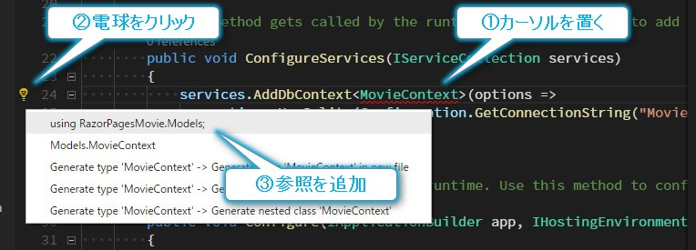

# ハンズオン
今回のハンズオンはASP.NET Core 2.0 Razor Pagesです。

## ハンズオン環境
[事前準備]()に従ってハンズオン環境を整えてください。

## ASP.NET Core Razor Pagesとは？
[ASP.NET Core での Razor ページの概要 | Microsoft Docs](https://docs.microsoft.com/ja-jp/aspnet/core/mvc/razor-pages/)

## 題材
[Mac で ASP.NET Core を使用して Razor ページ Web アプリを作成する | Microsoft Docs](https://docs.microsoft.com/ja-jp/aspnet/core/tutorials/razor-pages-mac/)

## 手順
### Razor Pageのプロジェクトを作成する
コマンドプロンプトやPowershell、ターミナルなどで以下のコマンドを入力します。

```
mkdir fukuten
dotnet new razor -o RazorPagesMovie
```

### Visual Studio Codeでプロジェクトを開く
`RazorPagesMovie`ディレクトリをVisual Studio Codeで開きましょう。

### まず実行してみる
#### コマンドで実行する
Visual Studio Codeのターミナルで以下のコマンドを入力します。

```
cd RazorPagesMovie
dotnet run
```

`dotnet run`コマンドで`Kestrel`というASP.NET Coreのビルドインサーバが起動します。  
Kestrelについてはこちらをご覧ください。  
[ASP.NET Core の kestrel web サーバーの実装 | Microsoft Docs](https://docs.microsoft.com/ja-jp/aspnet/core/fundamentals/servers/kestrel?tabs=aspnetcore2x)

ブラウザで[http://localhost:5000](http://localhost:5000)にアクセスしてみましょう。  
Kestrelを停止する場合はターミナルにて`Ctrl+C`を入力します。

#### Visual Studio Codeで実行する
1. メニュー **デバッグ** > **デバッグの開始** をクリックします。
2. 環境の選択にて **.NET Core** を選択します。
3. `Error processing launch options at field: program`というエラーが表示された場合は以下を行ってください。
    1. エラーダイアログの`launch.json を開く`をクリックします。
    2. 環境の選択にて **.NET Core** を選択します。
    3. `.vscode`ディレクトリ内に`launch.json`ファイルが作成されます。
    4. 再度デバッグを開始します。

### モデルの追加
1. `RazorPagesMovie`ディレクトリの配下に`Models`ディレクトリを作成します。
2. `Models`ディレクトリに`Movie.cs`を作成します。
3. `Movie.cs`に下記のように映画に関するプロパティを定義します。

```cs
using System;

namespace RazorPagesMovie.Models
{
    public class Movie
    {
        public int ID { get; set; }
        public string Title { get; set; }
        public DateTime ReleaseDate { get; set; }
        public string Genre { get; set; }
        public decimal Price { get; set; }
    }
}
```

### DBコンテキストクラスの作成
1. `Models`ディレクトリに`MovieContext.cs`を作成します。
2. `MovieContext.cs`に下記のようにDBに関する情報を定義します。

```cs
public class MovieContext : DbContext
{
    public MovieContext(DbContextOptions<MovieContext> options)
            : base(options)
    {
    }

    public DbSet<Movie> Movie { get; set; }
}
```

### データベース接続文字列の設定
1. `appsettings.json`に下記のようにデータベース接続文字列を記載します。今回はSQLiteを使用します。

```json
{
  "Logging": {
    (中略)
  },
  "ConnectionStrings": {
    "MovieContext": "Data Source=MvcMovie.db"
  }
}
```

### DBコンテキストの登録
1. `Startup.cs`の`ConfiguraServices`関数にて、下記のようにDBコンテキストをアプリケーションに登録する処理を定義します。
2. 不足している参照を追加します(2箇所)。手順は下記の画像を参照。

```cs
public void ConfigureServices(IServiceCollection services)
{
    (中略)

    services.AddDbContext<MovieContext>(options =>
        options.UseSqlite(Configuration.GetConnectionString("MovieContext")));

    (中略)
}
```



### マイグレーションの設定
1. `RazorPagesMovie.csproj`ファイルを開きます。
2. 2つ目の`<ItemGroup>`要素に`Microsoft.EntityFrameworkCore.Tools.DotNet`を記載します。
3. `dotnet restore`コマンドを実行し、パッケージを復元します。

```xml
<ItemGroup>
  <DotNetCliToolReference Include="Microsoft.VisualStudio.Web.CodeGeneration.Tools" Version="2.0.0" />
  <DotNetCliToolReference Include="Microsoft.EntityFrameworkCore.Tools.DotNet" Version="2.0.0" />
</ItemGroup>
```

### スキャフォールディングツールのインストール
以下のコマンドを実行し、スキャフォールディングツールをプロジェクトに加えます。

```shell
dotnet add package Microsoft.VisualStudio.Web.CodeGeneration.Design
dotnet restore
```

### マイグレーションの実行
以下のコマンドを実行し、データベースのマイグレーションを行います。  
`Migrations`ディレクトリにマイグレーションファイルが作成されます。  
マイグレーションファイルには、DBに`CREATE TABLE`文を実行するコマンドが定義されていますので、一度目を通しておきましょう。

```shell
dotnet ef migrations add InitialCreate
dotnet ef database update
```

### スキャフォールディングの実行
以下のコマンドを実行し、`Movie`モデルのスキャフォールディングを行います。  
これにより`Movie`モデルのCRUD機能(Create/Read/Update/Delete)に必要なファイルが生成されます。

```shell
dotnet aspnet-codegenerator razorpage -m Movie -dc MovieContext -udl -outDir Pages/Movies --referenceScriptLibraries
```

## 動作確認
1. `dotnet run`コマンドまたはVisual Studio Codeでのデバッグにて、アプリケーションを実行します。
2. `http://localhost:5000/movies`にアクセスします。
3. データの表示、追加、更新、削除を行ってみましょう。

以上で ASP.NET Core 2.0 RazorPagesのハンズオンは終わりです。
