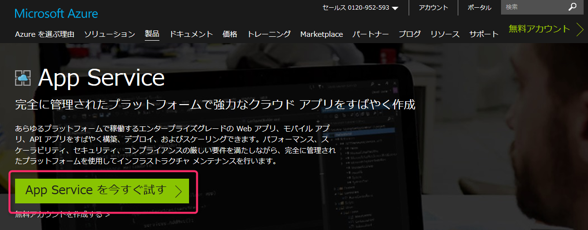
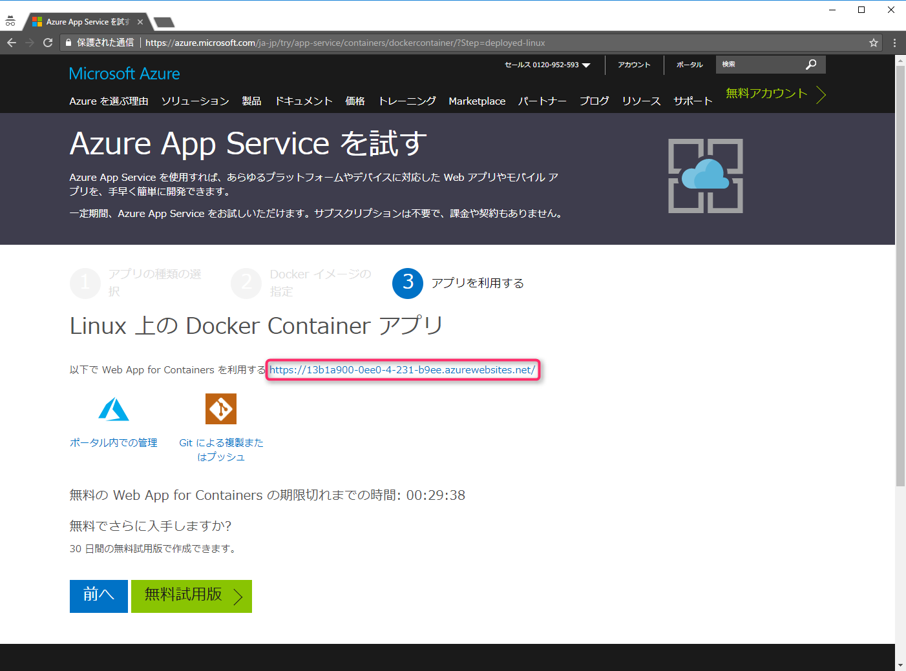
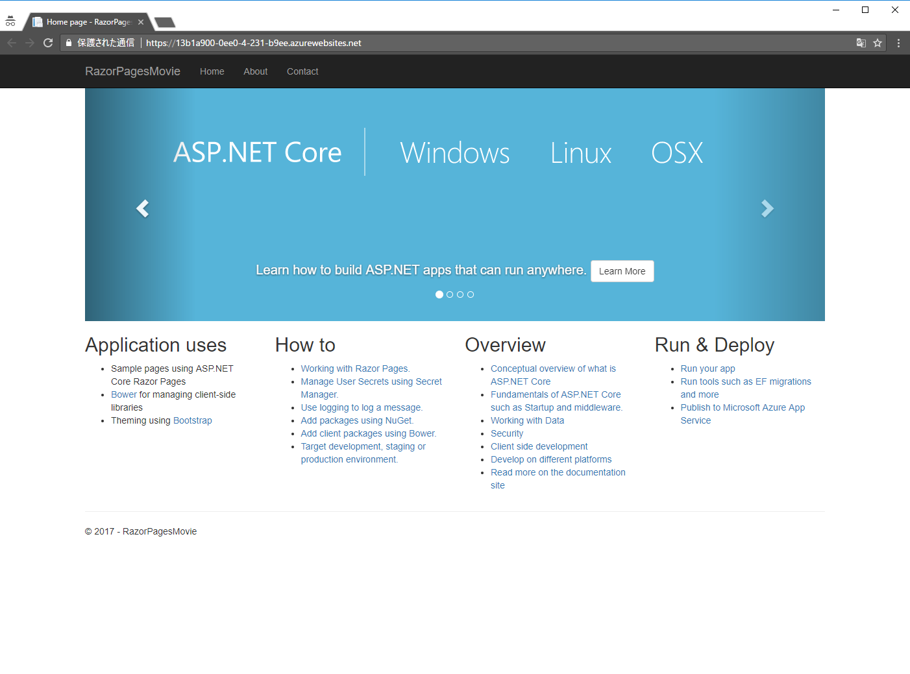
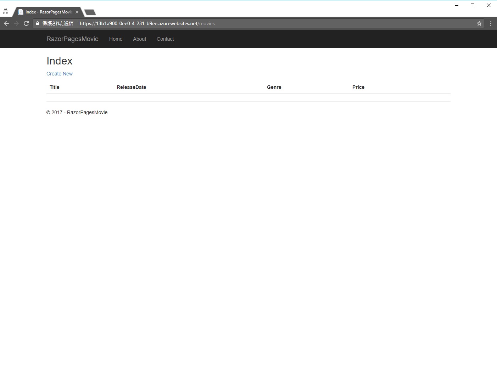

# ハンズオン
今回のハンズオンは前回Docker Hubに作成したコンテナをアップロードしましたので、そちらを[Azure Web App for Containers](https://azure.microsoft.com/ja-jp/services/app-service/containers/)
にデプロイしてみましょう。

## ハンズオン環境
MSアカウントをお持ちでない方は、事前に[こちら](https://www.microsoft.com/ja-jp/msaccount/signup)からMSアカウントの作成をお願いします。

### 参考
[App Service - Web App for Containers | Microsoft Azure](https://azure.microsoft.com/ja-jp/services/app-service/containers/)

[Azure Web App for Containers Documentation - Tutorials, API Reference | Microsoft Docs](https://docs.microsoft.com/en-us/azure/app-service/containers/)

## 題材
まだ[fukuten/razorapp - Docker Hub](https://hub.docker.com/r/fukuten/razorapp/)のハンズオンが済んでいない方は先にそちらのハンズオンを実施してください。

## 手順
### Step1
[Azure Web App for Containers](https://azure.microsoft.com/ja-jp/services/app-service/containers/)より『App Serviceを今すぐ試す』をクリックします。

### Step2
アプリの種類を選択します。  
『Web App for Containers』を選択し『次へ』をクリックします。

### Step3
Docker HUBに作成したコンテナを指定します。  
『Docker』に`fukuten/razorapp:latest`を入力し『作成』をクリックします。

### Step4
以下の画面が出たらデプロイは完了です！！  
『以下でWeb App Containersを…』右側のURLをクリックして確認してみましょう。

## 動作確認
### Step5

### Step6
URLに`/movies`を付与してアクセスします。  
データの表示、追加、更新、削除を行ってみましょう。

以上で Azure Web App for Containersのハンズオンは終わりです。